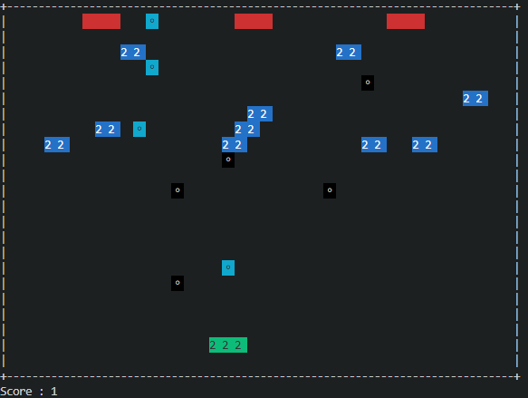

### Assign 7
遊戲說明:  
玩家會在場地最下方，有兩點生命值，可以用AD左右移動，並使用W射擊，玩家射擊有三幀，場地的中間會有10個隨機生成位置的目標方塊，每個方塊有兩點生命值，要打兩下才能獲得一分，每打掉一個方塊，就會在隨機位置再生成一個方塊，在場地的最上方會有Enemy NPC，NPC發射會跟隨玩家的子彈，NPC會在40幀和80幀的時候增加兩隻，最後會有5隻。  
玩家勝利條件:射擊目標方塊，破壞方塊可以獲得分數，達到10分勝利。  
玩家失敗條件:被NPC射中兩次。  
子彈擊中判定:完全覆蓋才算擊中，邊邊碰到不算。  

